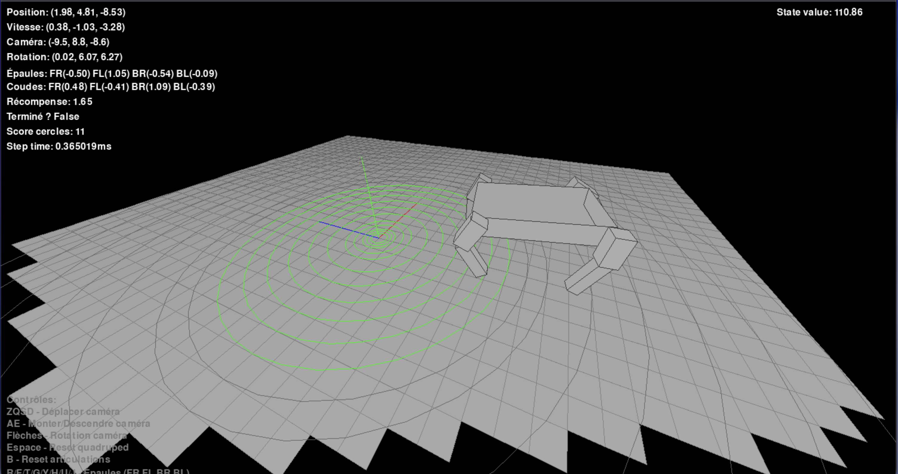

# Quadruped‑RL: Learning to Walk with a Lightweight Physics Engine

## 1. Overview
This project explores **model‑free reinforcement learning** for locomotion control of a simulated quadruped robot.  
A minimalist 3‑D physics engine written with NumPy and Pygame is coupled with an **actor–critic agent** that learns to produce joint torques (discretised as $\{-1,0,1\}$) and propel the robot forward while maintaining balance.

---

## 2. Environment

### 2.1 Physics Mini‑Engine  
* 240 Hz fixed‑step integration (`DT = 1/240 s`).  
* Vertices‑only collision detection against an infinite plane.  
* Impulse‑based contact model with restitution $e=0.2$ and kinetic friction $\mu = 0.5$.  
* Soft velocity caps and Polyak‑style inertia damping ensure numerical stability.  

### 2.2 State Representation  
Each observation $s_t \in \mathbb{R}^{59}$ concatenates  

| Block | Dim | Content |
|-------|----:|---------|
| Base kinematics | 21 | position, linear velocity, Euler rotations, joint angles & angular velocities |
| Bounding boxes | 6 | $\min/\max$ of body vertices along $(x,y,z)$ |
| Per‑leg height | 8 | $\min/\max\ y$ of each leg |
| Joint angle caps | 16 | binary flags for $\pm\frac{\pi}{2}$ limits |
| Safety flags | 8 | danger‑zone indicators & time‑since flags |

### 2.3 Reward  
Let $d_t$ be forward distance, $\phi_t = |pitch|+|yaw|+|roll|$. The per‑step reward  
$$
r_t = 0.2\,[d_t>d_{t-1}] \;+\; 20\,(d_t - d_{t-1}) \;-\; 0.5\,\mathbb{1}_{\text{height danger}} \;-\; \lambda_\text{tilt}\,\phi_t
$$
plus sparse bonuses of $+2$ when crossing radii $\{0.5,0.75,1,\dotsc,10\}$.  
Episodes terminate when height leaves $[4.5,5.5]$ for a sustained window or when the maximum number of steps is reached.

---

## 3. Reinforcement Learning Formulation

### 3.1 Agent Architecture  
The **QuadrupedAgent** couples  
* **Actor** $\pi_\theta(a\mid s)$: three‑layer MLP with GELU+LayerNorm, outputting per‑joint logits reshaped to $(8,3)$.  
* **Critic** $V_\phi(s)$: duelling value head sharing the same backbone depth.  
Target critic $\phi'$ is updated by Polyak averaging  
$$
\phi' \leftarrow \tau\,\phi' + (1-\tau)\,\phi,\qquad \tau = 0.995.
$$

### 3.2 Training Signal  
Replay buffer $D$ (size $10^3$) stores tuples $(s,a,r,\,d,\,s')$.  
For a minibatch $B$:

* **TD‑target**  
  $$
  y_i = r_i + \gamma(1-d_i)\,V_{\phi'}(s'_i)
  $$
* **Advantages**  
  $$
  A_i = y_i - V_\phi(s_i)
  $$

* **Critic loss**  
  $$
  \mathcal{L}_c = \frac1{|B|}\sum_{i}\bigl(y_i - V_\phi(s_i)\bigr)^2
  $$

* **Actor loss** (categorical policy with per‑joint independence)  
  $$
  \mathcal{L}_a = -\frac1{|B|}\sum_{i} \underbrace{\log\pi_\theta(a_i\mid s_i)}_{\text{sum over 8 joints}}\;A_i
  \;-\;\beta\,\mathcal{H}\bigl[\pi_\theta(\cdot\mid s_i)\bigr],\qquad \beta=0.1.
  $$

Total loss $\mathcal{L} = \mathcal{L}_a + \mathcal{L}_c$.

### 3.3 Exploration  
An **ε‑greedy** wrapper selects a random joint vector with probability  
$$
\varepsilon = \max\!\Bigl(\varepsilon_\text{min},\,\varepsilon_0\,\delta^{\,t}\Bigr),
\quad
\varepsilon_0 = 0.5,\;\varepsilon_\text{min}=0.01,\;\delta=0.998.
$$

---

## 4. Strategic Design Choices

| Decision | Rationale |
|----------|-----------|
| **Discrete $[-1,0,1]$ torques** | Drastically reduces the action space, permitting categorical sampling and stable entropy regularisation while still enabling diverse gaits. |
| **Small replay buffer** | Keeps training on‑policy‑ish and memory‑light; helps the critic track rapidly shifting dynamics caused by sparse rewards. |
| **Per‑joint independence** | Breaks the $3^8$ combinatorial space into eight 3‑way softmaxes, avoiding an intractable $6561$‑class output head. |
| **Dense distance shaping + sparse circles** | Combines smooth learning signals with milestone incentives to avoid local minima where the agent ‘hovers’ near the start. |
| **Safety height window** | Prevents exploitation of glitchy airborne states that the simple contact model may permit. |
| **Agg visualization module** | Off‑GUI Matplotlib backend (`Agg`) generates high‑resolution plots without slowing the main loop. |
| **Polyak‑averaged target critic** | Smooths bootstrapping targets, essential when the critic network is lightweight and the environment highly discontinuous. |

---