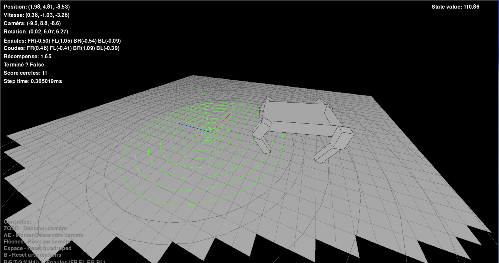

# Quadruped-RL: Learning to Walk with a Lightweight Physics Engine



## Table Of Contents

1. [Overview](#1-overview)
2. [Running The Project](#2-running-the-project)
3. [Environment](#3-environment)
   1. [Physics Mini-Engine](#31-physics-mini-engine)
   2. [State Representation](#32-state-representation)
   3. [Action Space](#33-action-space)
   4. [Reward And Termination Contract](#34-reward-and-termination-contract)
4. [Physical Simulation](#4-physical-simulation)
   1. [Units And Time Step](#41-units-and-time-step)
   2. [Rigid Body State](#42-rigid-body-state)
   3. [Articulated Geometry](#43-articulated-geometry)
   4. [Mass, Center Of Mass, And Inertia](#44-mass-center-of-mass-and-inertia)
   5. [Joint Motor Model](#45-joint-motor-model)
   6. [Time Integration](#46-time-integration)
   7. [Contact Candidate Selection](#47-contact-candidate-selection)
   8. [Normal Contact Solver](#48-normal-contact-solver)
   9. [Tangential Friction Solver](#49-tangential-friction-solver)
   10. [Penetration Correction And Velocity Limits](#410-penetration-correction-and-velocity-limits)
   11. [Known Approximations](#411-known-approximations)
5. [Reinforcement Learning Formulation](#5-reinforcement-learning-formulation)
   1. [Policy Factorization](#51-policy-factorization)
   2. [Actor And Critic Networks](#52-actor-and-critic-networks)
   3. [GAE Returns](#53-gae-returns)
   4. [PPO-Style Update](#54-ppo-style-update)
   5. [Exploration](#55-exploration)
6. [Strategic Design Choices](#6-strategic-design-choices)
7. [Caveats](#7-caveats)

---

## 1. Overview

This project explores **model-free reinforcement learning** for locomotion control of a simulated quadruped robot.

It couples:

- a lightweight 3-D physics engine written with NumPy and Pygame;
- an articulated quadruped model with body, upper-leg, and lower-leg parts;
- a custom impulse-based ground contact solver;
- an on-policy actor-critic agent using GAE and a PPO-style clipped policy update.

The task is deliberately narrow:

```text
move forward while keeping a valid posture
```

The reward is currently kept minimal and auditable: forward progress while valid, terminal penalty when invalid. There is no active velocity reward, sparse checkpoint reward, action smoothness penalty, or dense hand-tuned penalty soup.

---

## 2. Running The Project

Run the example physics scenes:

```bash
python -m physics_env.examples.first_scene
python -m physics_env.examples.floor_and_wall
python -m physics_env.examples.floor_and_ramp
python -m physics_env.examples.staircase
python -m physics_env.examples.tilted_cube
```

Run the manual quadruped environment:

```bash
python -m physics_env.envs.quadruped_env
```

Manual controls:

| Key | Action |
|---|---|
| `ZQSD` | Move camera |
| `AE` | Move camera up/down |
| Arrow keys | Rotate camera |
| `R/F/T/G/Y/H/U/J` | Shoulder joints |
| `1-8` | Elbow joints |
| `Space` | Reset with randomization |
| `B` | Reset without randomization |
| `P` | Print current state |
| `Esc` | Quit |

Train the agent:

```bash
python main.py
```

Watch a trained agent:

```bash
python test.py
```

Important training behavior:

- `main.py` currently uses `load_model=True`, so training resumes from `saved_models/quadruped_agent.pth`.
- Set `load_model=False` in `main.py` to train from scratch.
- `Ctrl+C` triggers the `KeyboardInterrupt` fallback and saves the current model snapshot.
- `saved_models/quadruped_agent_epoch_<episode>.pth` is written on save.
- `saved_models/quadruped_agent.pth` is created only if it does not already exist; it is not overwritten.

---

## 3. Environment

### 3.1 Physics Mini-Engine

The quadruped environment is not built on MuJoCo, Bullet, or Isaac Gym. It uses a compact custom physics loop:

- fixed-step simulation at `PHYSICS_HZ = 120`;
- quaternion orientation integration;
- articulated local geometry for shoulders and elbows;
- dynamic mass and inertia recomputation from transformed body parts;
- vertex-based contact detection against the ground plane;
- sequential normal impulse solve;
- Coulomb-style tangential friction solve;
- position correction for residual penetration.

### 3.2 State Representation

The environment observation is:

```math
\mathbf{s}_t \in \mathbb{R}^{75}.
```

It extends the quadruped's internal 59-dimensional state with joint-limit counters and previous action:

| Block | Dim | Content |
|---|---:|---|
| Base kinematics | 25 | position, linear velocity, Euler rotation, shoulder angles/velocities, elbow angles/velocities |
| Body bounds | 6 | body vertex $\min/\max$ along $(x,y,z)$ |
| Per-leg height | 8 | $\min/\max\ y$ for each full leg |
| Joint cap flags | 16 | binary flags near $\pm \frac{\pi}{2}$ for shoulders and elbows |
| Safety flags | 4 | `too_high`, `too_low`, normalized steps since each flag |
| Joint-limit progress | 8 | shoulder/elbow timeout counters normalized by the timeout horizon |
| Previous action | 8 | previous shoulder/elbow action vector |

### 3.3 Action Space

The action is an 8-dimensional discrete vector:

```math
\mathbf{a}_t =
\begin{bmatrix}
a_{t,1} & \cdots & a_{t,8}
\end{bmatrix},
\qquad
a_{t,j} \in \{-1,0,1\}.
```

The first 4 components control shoulders; the last 4 control elbows. Each component is converted into a target joint speed scaled by `SHOULDER_DELTA` or `ELBOW_DELTA`.

### 3.4 Reward And Termination Contract

Forward progress is measured along negative world $z$:

```math
d_t = -p_{t,z},
\qquad
\Delta d_t = d_t - d_{t-1}.
```

The current reward contract is:

```math
r_t =
\begin{cases}
\kappa\,\Delta d_t, & \text{if posture is valid},\\
p_{\mathrm{terminal}}, & \text{if posture is invalid},
\end{cases}
\qquad
\kappa = 1.0.
```

The active terminal failures are:

| Failure | Condition |
|---|---|
| `too_low` | body height below `MIN_BODY_HEIGHT` |
| `too_high` | body height above `MAX_BODY_HEIGHT` |
| `critical_tilt` | max body tilt above `CRITICAL_TILT_ANGLE` |
| `joint_limit_timeout` | any shoulder/elbow stays near its limit too long |

---

## 4. Physical Simulation

### 4.1 Units And Time Step

The engine uses its own length unit. The current scale is:

```math
1\ \text{engine unit} = 0.20\ \text{m}.
```

The fixed time step is:

```math
\Delta t = \frac{1}{120}.
```

Rendering is decoupled from physics by `PHYSICS_STEPS_PER_RENDER`.

### 4.2 Rigid Body State

The body state is:

```math
\left(\mathbf{p},\mathbf{v},q,\boldsymbol{\omega}\right),
```

where:

| Symbol | Meaning |
|---|---|
| $\mathbf{p}$ | body origin position |
| $\mathbf{v}$ | body origin linear velocity |
| $q$ | orientation quaternion |
| $\boldsymbol{\omega}$ | angular velocity |

The body origin is not necessarily the center of mass. The world center of mass is:

```math
\mathbf{p}_{\mathrm{com}}
= \mathbf{p} + R(q)\,\mathbf{c}_{\mathrm{local}},
```

where $R(q)$ is the rotation matrix from the current quaternion and $\mathbf{c}_{\mathrm{local}}$ is the local center of mass.

### 4.3 Articulated Geometry

The quadruped is represented as 9 cuboid parts:

```text
body + 4 upper legs + 4 lower legs
```

Each part has 8 vertices. Shoulder and elbow rotations transform local vertices before the global body transform is applied:

```math
\mathbf{x}_{i}^{\mathrm{world}}
= R(q)\,\mathbf{x}_{i}^{\mathrm{local, articulated}} + \mathbf{p}.
```

For an upper leg, the local transform is a shoulder rotation around the leg shoulder anchor. For a lower leg, the local transform applies the shoulder rotation first, then an elbow rotation around the transformed elbow anchor.

### 4.4 Mass, Center Of Mass, And Inertia

Part masses are derived from a single uniform density instead of being stored as independent body/leg constants. The current total mass is preserved at $5.0$ kg, then distributed by cuboid volume:

```math
V_i = d_{x,i}d_{y,i}d_{z,i},
\qquad
\rho = \frac{M_{\mathrm{quad}}}{\sum_i V_i},
\qquad
m_i = \rho V_i.
```

With the current geometry this gives:

| Part | Volume | Derived mass |
|---|---:|---:|
| Body | $24.00$ unit$^3$ | $3.90625$ kg |
| Upper leg | $0.96$ unit$^3$ each | $0.15625$ kg each |
| Lower leg | $0.72$ unit$^3$ each | $0.11719$ kg each |

The local center of mass is recomputed from the transformed part centers:

```math
\mathbf{c}
= \frac{\sum_i m_i \mathbf{c}_i}{\sum_i m_i}.
```

Each part is approximated as a box. For part dimensions $(d_x,d_y,d_z)$:

```math
I_{\mathrm{box}}
=
\begin{bmatrix}
\frac{m}{12}(d_y^2+d_z^2) & 0 & 0\\
0 & \frac{m}{12}(d_x^2+d_z^2) & 0\\
0 & 0 & \frac{m}{12}(d_x^2+d_y^2)
\end{bmatrix}.
```

The total inertia uses the parallel-axis theorem:

```math
I_{\mathrm{body}}
{}+= R_i I_{\mathrm{box},i} R_i^\top
{}+ m_i\left(\|\mathbf{d}_i\|^2 I - \mathbf{d}_i\mathbf{d}_i^\top\right),
```

with:

```math
\mathbf{d}_i = \mathbf{c}_i - \mathbf{c}.
```

The world inverse inertia is:

```math
I_{\mathrm{world}}^{-1}
= R(q)\,I_{\mathrm{body}}^{-1}\,R(q)^\top.
```

### 4.5 Joint Motor Model

Actions do not directly set joint angles. They set a target speed:

```math
v_{\mathrm{target}} = \Delta_{\mathrm{joint}}\,a_{t,j}.
```

The internal motor update is a damped first-order response:

```math
v_j
\leftarrow
v_j + \alpha\left(v_{\mathrm{target}} - v_j\right),
```

```math
v_j
\leftarrow
v_j(1-\eta),
```

```math
\theta_j
\leftarrow
\mathrm{clip}\left(\theta_j + v_j,\ -\frac{\pi}{2},\ \frac{\pi}{2}\right).
```

`MOTOR_DIFFICULTY` modulates response and damping. At the joint limits, velocities pushing further into the limit are zeroed.

### 4.6 Time Integration

The linear update is semi-implicit:

```math
\mathbf{v}
\leftarrow
\mathbf{v} + \mathbf{g}\Delta t,
```

```math
\mathbf{p}
\leftarrow
\mathbf{p} + \mathbf{v}\Delta t.
```

Orientation uses an incremental quaternion:

```math
\theta = \|\boldsymbol{\omega}\|\Delta t,
\qquad
\mathbf{u} = \frac{\boldsymbol{\omega}}{\|\boldsymbol{\omega}\|},
```

```math
\Delta q =
\begin{bmatrix}
\cos(\theta/2)\\
\mathbf{u}\sin(\theta/2)
\end{bmatrix},
\qquad
q \leftarrow \mathrm{normalize}(\Delta q \otimes q).
```

### 4.7 Contact Candidate Selection

The contact solver operates on vertices near the ground plane:

```math
y_i \le h_{\mathrm{contact}}.
```

The contact threshold expands with vertical velocity:

```math
h_{\mathrm{contact}}
= \max\left(h_0,\ |\mathbf{v}_y|\Delta t\,\alpha\right).
```

The solver keeps at most `MAX_CONTACT_POINTS` vertices and enforces a minimum spacing in the $(x,z)$ plane to avoid over-constraining clusters of nearly identical contact points.

### 4.8 Normal Contact Solver

For a contact point, define:

```math
\mathbf{r} = \mathbf{x}_{\mathrm{contact}} - \mathbf{p}_{\mathrm{com}},
```

```math
\mathbf{v}_{\mathrm{contact}}
= \mathbf{v}_{\mathrm{com}}
{}+ \boldsymbol{\omega} \times \mathbf{r}
{}+ \mathbf{v}_{\mathrm{articulation}}.
```

The normal velocity is:

```math
v_n = \mathbf{v}_{\mathrm{contact}}\cdot\mathbf{n},
\qquad
\mathbf{n} =
\begin{bmatrix}
0\\
1\\
0
\end{bmatrix}.
```

A Baumgarte-style bias compensates penetration:

```math
b = \beta\,\frac{\max(0,\ \mathrm{penetration}-\mathrm{slop})}{\Delta t}.
```

The effective mass denominator along the normal is:

```math
D_n
= \frac{1}{m}
{}+ \mathbf{n}\cdot
\left(
\left(I_{\mathrm{world}}^{-1}(\mathbf{r}\times\mathbf{n})\right)
\times \mathbf{r}
\right).
```

The normal impulse increment is:

```math
\Delta j_n
= -\frac{v_n + b}{D_n}.
```

Accumulated normal impulse is clamped to be non-negative:

```math
j_n \leftarrow \max(0,\ j_n + \Delta j_n).
```

The impulse is applied as:

```math
\mathbf{v}_{\mathrm{com}}
\leftarrow
\mathbf{v}_{\mathrm{com}} + \frac{\mathbf{J}}{m},
```

```math
\boldsymbol{\omega}
\leftarrow
\boldsymbol{\omega}
{}+ I_{\mathrm{world}}^{-1}(\mathbf{r}\times\mathbf{J}).
```

### 4.9 Tangential Friction Solver

The tangential velocity is:

```math
\mathbf{v}_t
= \mathbf{v}_{\mathrm{contact}}
{}- (\mathbf{v}_{\mathrm{contact}}\cdot\mathbf{n})\mathbf{n}.
```

If $\|\mathbf{v}_t\| > 0$, the tangent direction is:

```math
\mathbf{t} = \frac{\mathbf{v}_t}{\|\mathbf{v}_t\|}.
```

The tangential impulse is constrained by a Coulomb cone:

```math
\|\mathbf{j}_t\| \le \mu j_n.
```

In practice the solver accumulates a candidate tangential impulse and clamps its norm:

```math
\mathbf{j}_t
\leftarrow
\mathrm{clamp}_{\|\cdot\|\le \mu j_n}
\left(\mathbf{j}_t + \Delta j_t\,\mathbf{t}\right).
```

### 4.10 Penetration Correction And Velocity Limits

Residual penetration is corrected positionally:

```math
\mathbf{p}_y
\leftarrow
\mathbf{p}_y
{}+ c_{\mathrm{pos}}\max(0,\ \mathrm{maxPenetration}-\mathrm{slop}).
```

Linear and angular velocities are capped:

```math
\|\mathbf{v}\| \le v_{\max},
\qquad
\|\boldsymbol{\omega}\| \le \omega_{\max}.
```

### 4.11 Known Approximations

This is a lightweight custom physics engine, not a general rigid-body simulator. Important approximations:

- contact is vertex-plane, not full mesh-mesh collision;
- the quadruped environment primarily solves ground contact against $y=0$;
- joints are geometry-driven motor updates, not full constraint-space joints;
- friction is a simplified Coulomb impulse clamp;
- integration is simple and fixed-step;
- contact ordering and manifold reduction are heuristic.

---

## 5. Reinforcement Learning Formulation

### 5.1 Policy Factorization

The actor outputs per-joint categorical logits:

```math
\pi_\theta(\mathbf{a}_t\mid\mathbf{s}_t)
=
\prod_{j=1}^{8}
\mathrm{Categorical}
\left(a_{t,j}\mid\mathrm{logits}_{\theta,j}(\mathbf{s}_t)\right).
```

This avoids a single $3^8 = 6561$-class action head while still allowing the shared trunk to learn coordination between joints.

### 5.2 Actor And Critic Networks

Both networks are MLPs with GELU activations and LayerNorm.

The actor maps:

```math
\mathbf{s}_t \in \mathbb{R}^{75}
\longmapsto
\mathrm{logits}_t \in \mathbb{R}^{8\times 3}.
```

The critic maps:

```math
\mathbf{s}_t \in \mathbb{R}^{75}
\longmapsto
V_\phi(\mathbf{s}_t) \in \mathbb{R}.
```

### 5.3 GAE Returns

For each rollout:

```math
\delta_t
= r_t + \gamma(1-d_t)V_\phi(\mathbf{s}_{t+1})
{}- V_\phi(\mathbf{s}_t),
```

```math
A_t
= \delta_t
{}+ \gamma\lambda(1-d_t)A_{t+1}.
```

Returns are:

```math
R_t = A_t + V_\phi(\mathbf{s}_t).
```

Advantages are normalized before the policy update.

### 5.4 PPO-Style Update

The old behavior policy is represented by stored rollout log-probabilities:

```math
\log \pi_{\mathrm{old}}(\mathbf{a}_t\mid\mathbf{s}_t).
```

The PPO ratio is:

```math
\rho_t(\theta)
=
\exp\left(
\log \pi_\theta(\mathbf{a}_t\mid\mathbf{s}_t)
{}- \log \pi_{\mathrm{old}}(\mathbf{a}_t\mid\mathbf{s}_t)
\right).
```

The clipped actor objective is:

```math
\mathcal{L}_{\pi}
=
{}-\mathbb{E}_t
\left[
\min
\left(
\rho_t A_t,
\mathrm{clip}(\rho_t,1-\epsilon,1+\epsilon)A_t
\right)
\right]
{}- \beta\,\mathbb{E}_t
\left[
\mathcal{H}\left(\pi_\theta(\cdot\mid\mathbf{s}_t)\right)
\right].
```

The critic loss is:

```math
\mathcal{L}_{V}
=
\mathbb{E}_t
\left[
\left(V_\phi(\mathbf{s}_t)-R_t\right)^2
\right].
```

Training uses minibatches, several epochs per rollout, gradient clipping, and an approximate KL early stop:

```math
\widehat{D}_{\mathrm{KL}}
\approx
\mathbb{E}_t
\left[
\log \pi_{\mathrm{old}}(\mathbf{a}_t\mid\mathbf{s}_t)
{}- \log \pi_\theta(\mathbf{a}_t\mid\mathbf{s}_t)
\right].
```

### 5.5 Exploration

There is no active $\varepsilon$-greedy wrapper in the current training loop.

Exploration comes from:

- sampling actions from $\pi_\theta$ during training;
- the entropy term in $\mathcal{L}_{\pi}$;
- stochasticity induced by rollout collection and policy updates.

---

## 6. Strategic Design Choices

| Decision | Rationale |
|---|---|
| **Discrete $[-1,0,1]$ joint commands** | Keeps the action space small and compatible with categorical PPO. |
| **Per-joint categorical factorization** | Avoids a $6561$-class action head while keeping a shared network trunk for coordination. |
| **Progress-only locomotion reward** | Makes the optimized quantity auditable: reward tracks signed forward displacement while valid. |
| **Hard terminal validity gates** | Invalid posture terminates the episode instead of competing through arbitrary dense penalties. |
| **No velocity reward** | Prevents the agent from exploiting instantaneous velocity without net displacement. |
| **On-policy rollouts** | Keeps PPO ratios meaningful; there is no replay buffer in the current implementation. |
| **Impulse-based contact solver** | Lightweight enough for iteration while still modeling normal support and Coulomb-style friction. |
| **Agg Matplotlib visualizations** | Training plots can be generated without an interactive GUI backend. |

---

## 7. Caveats

Training is still experimental. Stochastic rollouts can show forward progress before deterministic evaluation becomes robust.

The physics engine is intentionally lightweight and should be treated as a research sandbox, not a production-grade rigid-body simulator.

Observation normalization is not currently implemented.
